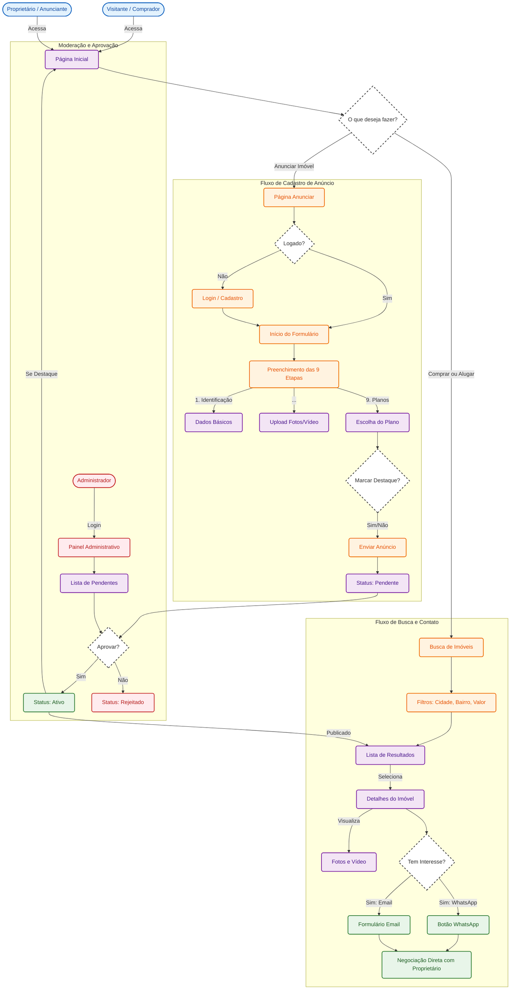

# Fluxograma de Processos - Imóveis daki do Bairro

Este documento apresenta o fluxo completo dos processos de Compra, Aluguel e Venda (Anúncio) na plataforma.

## Legenda de Cores
- **Azul**: Ações do Usuário (Visitante/Proprietário)
- **Laranja**: Ações no Sistema (Clicar, Preencher, Buscar)
- **Roxo**: Telas e Processos do Sistema
- **Vermelho**: Área Administrativa
- **Verde**: Sucesso / Finalização (Contato, Publicação)
