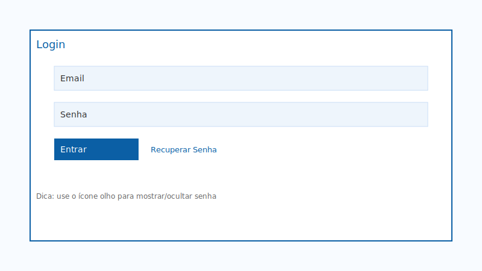
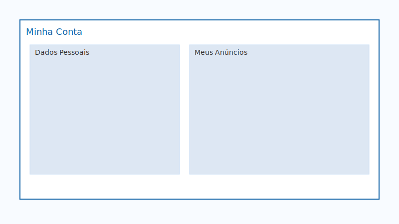
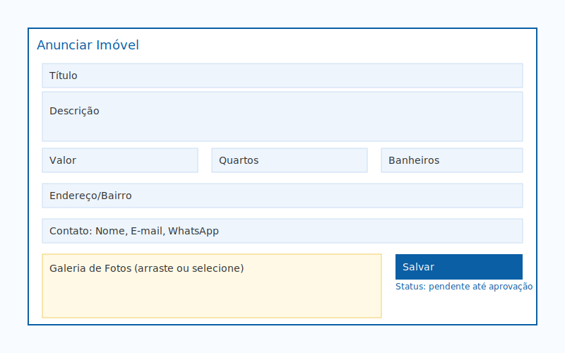
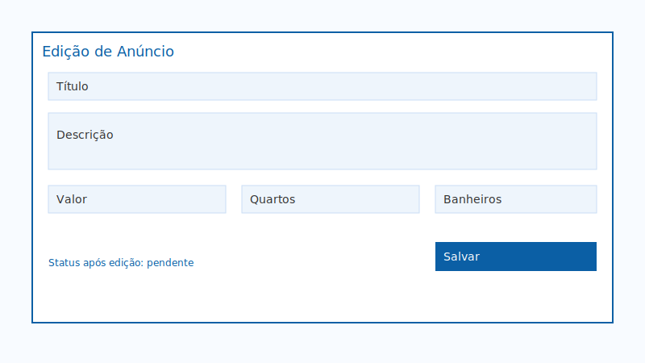
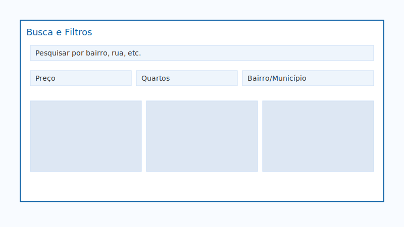
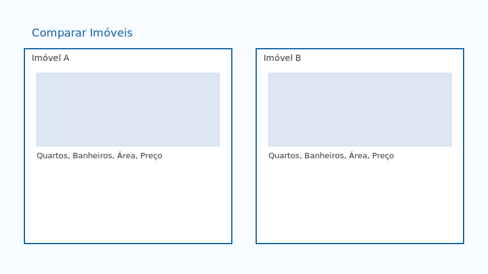
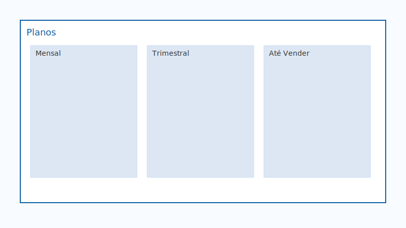
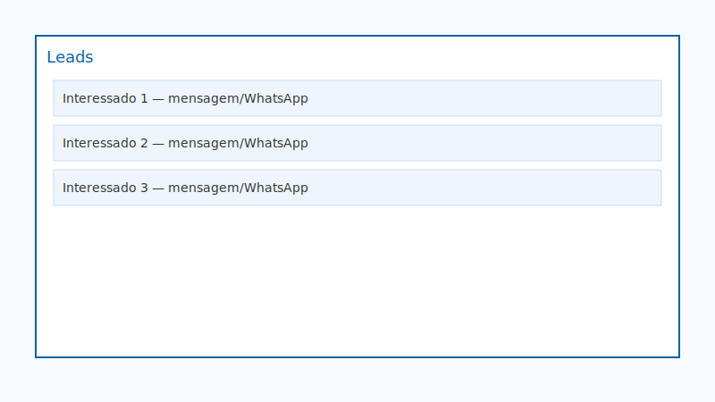

# Manual do Usuário — Imóveis daki do Bairro
Versão 1.0 • Público-alvo: usuários, proprietários, imobiliárias e corretores

## Sumário
- [Visão Geral](#visão-geral)
- [1) Cadastro e Acesso](#1-cadastro-e-acesso)
- [2) Minha Conta](#2-minha-conta)
- [3) Anunciar Imóvel](#3-anunciar-imóvel)
- [4) Edição de Imóvel](#4-edição-de-imóvel)
- [5) Visualização do Imóvel (Página de Detalhe)](#5-visualização-do-imóvel-página-de-detalhe)
- [6) Busca, Filtros e Mapa](#6-busca-filtros-e-mapa)
- [7) Favoritos e Comparar](#7-favoritos-e-comparar)
- [8) Imobiliárias e Corretores](#8-imobiliárias-e-corretores)
- [9) Planos e Pagamento](#9-planos-e-pagamento)
- [10) Contato e Leads](#10-contato-e-leads)
- [11) Área Administrativa (Equipe/Administradores)](#11-área-administrativa-equipeadministradores)
- [12) Políticas e Segurança](#12-políticas-e-segurança)
- [13) Dicas Úteis](#13-dicas-úteis)
- [14) Suporte](#14-suporte)
- [15) Apêndice — Rotas Úteis](#15-apêndice--rotas-úteis)

## Visão Geral
- O portal permite anunciar, buscar e gerenciar imóveis do seu bairro.
- Fluxos principais: cadastro/login, recuperação de senha, criação/edição de anúncio, upload de imagens, contato com interessados, favoritos/comparar, e área administrativa para moderação.
- Este manual é ilustrativo e contém figuras simples. Substitua por capturas reais quando desejar.

## 1) Cadastro e Acesso
- Acessar "Cadastrar" pelo topo do site. [Figura: Página de Cadastro]
- Preencher nome, e‑mail e senha. Confirmar termos/políticas.
- Login: acessar "Entrar" e informar e‑mail/senha. [Figura: Página de Login]
- Mostrar/ocultar senha: ícone olho. [Figura: Toggle Mostrar Senha]
- Esqueceu a senha? Clique em "Recuperar Senha", informe e‑mail e siga o link enviado. [Figura: Fluxo de Recuperação]
  

## 2) Minha Conta
- Após login, acesse "Minha Conta" para visualizar seus dados e anúncios. [Figura: Minha Conta]
- Atualize informações pessoais quando necessário.
  

## 3) Anunciar Imóvel
- Clique em "Anunciar" para iniciar o cadastro. [Figura: Início do Anúncio]
- Preencha:
  - Título, descrição, valor, endereço/bairro.
  - Características: quartos, banheiros, área, vagas etc.
  - Contatos do anúncio: nome, e‑mail, telefone e WhatsApp do responsável.
- Upload de imagens:
  - Arraste ou selecione fotos (formatos comuns).
  - As imagens são organizadas em galeria para o anúncio. [Figura: Upload/Galeria]
- Salve para enviar à moderação (anúncios novos ficam "pendentes" até aprovação). [Figura: Status Pendente]
  

## 4) Edição de Imóvel
- Na sua listagem de anúncios, clique em "Editar".
- Ao editar, o status retorna para "pendente" para nova revisão pela equipe. [Figura: Edição + Pendente]
- Ajuste preço, texto, fotos e contatos conforme necessário e salve.
  

## 5) Visualização do Imóvel (Página de Detalhe)
- A galeria exibe as fotos com botão "Ver Fotos". [Figura: Galeria + Ver Fotos]
- Em dispositivos móveis, título/valor ficam legíveis fora da imagem. [Figura: Layout Mobile]
- Informação de localização e características aparecem abaixo. [Figura: Bloco de Informações]
  

## 6) Busca, Filtros e Mapa
- Use "Comprar" ou "Alugar" para navegar. [Figura: Listas]
- Filtros por bairro, preço e características. [Figura: Filtros]
- Visualização por município/bairro quando disponível. [Figura: Mapa/Região]
  

## 7) Favoritos e Comparar
- Em cada card, marque o imóvel como favorito para acessar depois. [Figura: Favoritar]
- Use a página "Comparar" para avaliar imóveis lado a lado. [Figura: Comparar]
  

## 8) Imobiliárias e Corretores
- Páginas dedicadas listam imobiliárias/corretores com perfil e anúncios. [Figura: Listagem]
- Cadastros específicos: "Cadastro Imobiliária" e "Cadastro Corretor". [Figura: Formulários]
- Usuários que escolhem "Imobiliária" no fluxo de anúncio são direcionados ao cadastro apropriado.
  

## 9) Planos e Pagamento
- Consulte "Planos" para ver opções (Mensal, Trimestral, Até Vender) e add‑on de Destaque. [Figura: Planos]
- Pagamento: siga instruções na página "Pagamento" quando disponível. [Figura: Pagamento]
  

## 10) Contato e Leads
- Interessados podem enviar mensagem pelo formulário ou WhatsApp configurado no anúncio. [Figura: Contato no Anúncio]
- Acesse "Leads" (quando disponível) para acompanhar contatos recebidos. [Figura: Leads]
  

## 11) Área Administrativa (Equipe/Administradores)
- Acesse "/admin" com perfil autorizado. [Figura: Admin Dashboard]
- Moderação de imóveis: listar pendentes, aprovar/editar. [Figura: Moderação]
- Usuários: listar e, se necessário, excluir (remove usuário, arquivos e dados relacionados). [Figura: Usuários]
- Logs e contagens: "Admin > Contadores" e "Leads". [Figura: Admin Itens]
  

## 12) Políticas e Segurança
- Políticas: Privacidade, Cookies, Qualidade e Termos de Uso. [Figura: Políticas]
- Moderação: conteúdo inadequado ou falso é removido; anúncios editados reentram em pendência até validação.
- Armazenamento de imagens em serviço seguro; não compartilhe senhas e dados sensíveis.

## 13) Dicas Úteis
- Fotos: use imagens nítidas, paisagísticas e com boa iluminação.
- Descrição: destaque diferenciais (proximidade de serviços, reformas, posição solar).
- Preço: mantenha atualizado; mudanças frequentes exigem revalidação.
- Contato: verifique se WhatsApp/telefone estão corretos para maximizar leads.

## 14) Suporte
- E‑mail: dsdodo18@hotmail.com
- WhatsApp: (98) 98856‑7987 • (98) 98147‑0668
- Instagram: @imoveis_daki_do_bairro

## 15) Apêndice — Rotas Úteis
- Página inicial: /
- Comprar: /comprar
- Alugar: /alugar
- Imobiliárias: /imobiliarias
- Corretores: /corretores
- Minha Conta: /minha-conta
- Anunciar: /anunciar
- Planos: /planos
- Pagamento: /pagamento
- Recuperar Senha: /recuperar-senha
- Redefinir Senha: /redefinir-senha
- Admin: /admin
- Políticas: /politica-de-privacidade /politica-de-cookies /politica-de-qualidade /termos-de-uso

---
Observação: substitua as figuras por prints reais quando possível. As imagens de exemplo ficam em `archive/manual/img/`.
